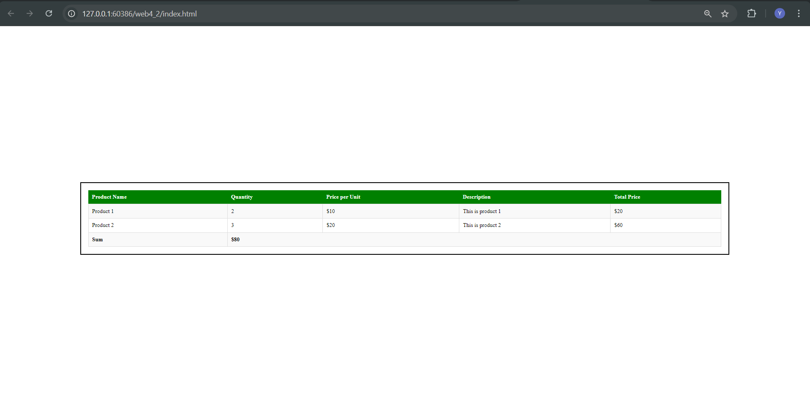

# web4_2
# Product Table Layout Using HTML and CSS

This project demonstrates a simple product table layout using HTML and CSS. It includes a list of products with columns for quantity, price per unit, description, and total price, along with a final sum row.

## Preview



## Features

- **Responsive Design**: The table is centered on the page and adapts to different screen sizes.
- **Styled Header**: The header row is styled with a green background and white text.
- **Alternate Row Colors**: The table uses alternating row colors for better readability.
- **Sum Row**: The sum row is highlighted with a light gray background for emphasis.

## How to Use

1. Clone the repository to your local machine:
    ```bash
    git clone https://github.com/your-username/your-repo-name.git
    ```

2. Navigate to the project directory:
    ```bash
    cd your-repo-name
    ```

3. Open `index.html` in your preferred browser to see the layout.

## Files

- **index.html**: Contains both the HTML and CSS for the table layout.
- **table_preview.png**: A screenshot preview of the table (optional).

## Customization

Feel free to modify the HTML and CSS to:
- Add more products or columns.
- Change the colors of the header or rows.
- Adjust the layout or add additional styling.

## License

This project is open source and available under the [MIT License](LICENSE).
